# flow.md — System Flows

**Project:** AuthLock
**Related documents:** [API-spec.md](API-spec.md) · [Architecture.md](Architecture.md) · [Security.md](Security.md)

All flows below reference the `VaultService` remote interface and error codes defined in [API-spec.md](API-spec.md). Every flow must remain consistent with that spec — if a flow changes, update API-spec.md in the same change (per [Development-rules.md](Development-rules.md) §4).

---

## 1. Login

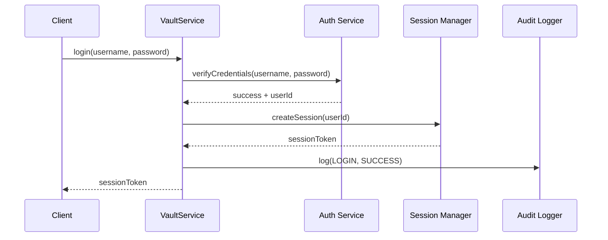

## 2. Authentication Failure

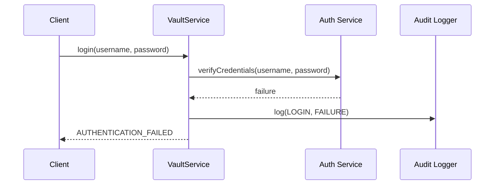

## 3. Session Creation

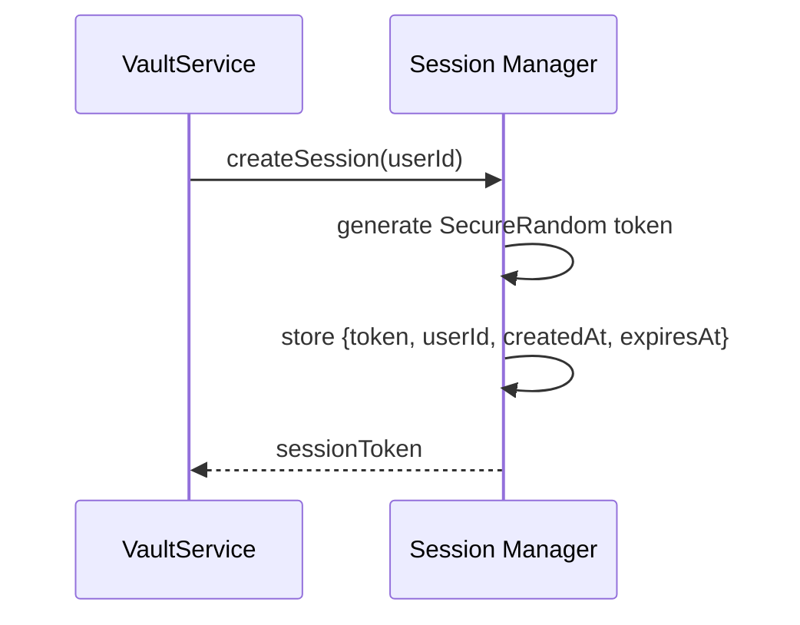

## 4. Session Validation

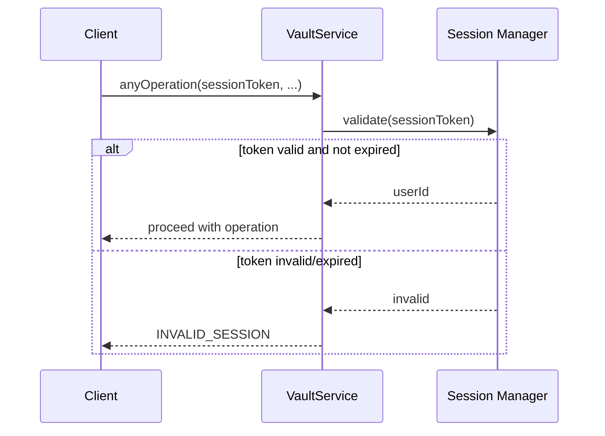

## 5. File Listing

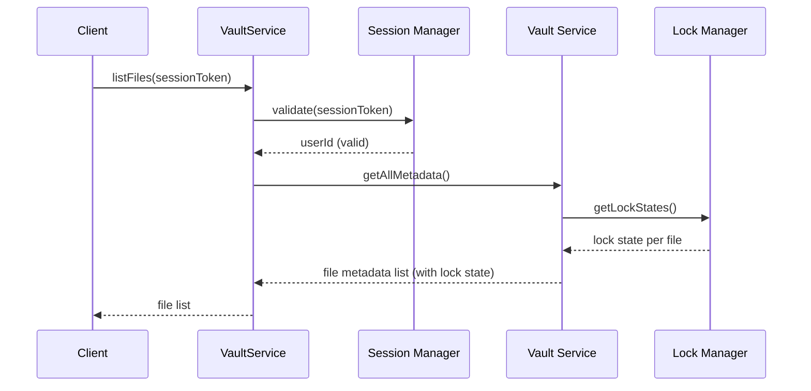

## 6. File Upload

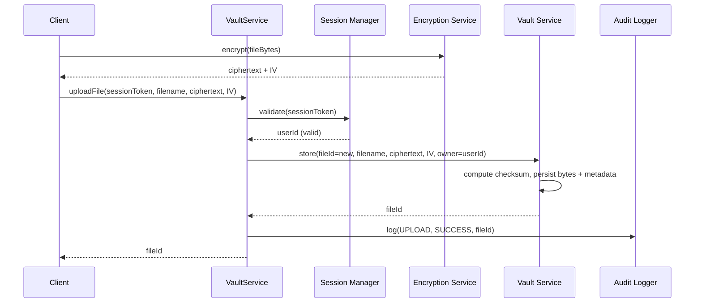

## 7. File Download

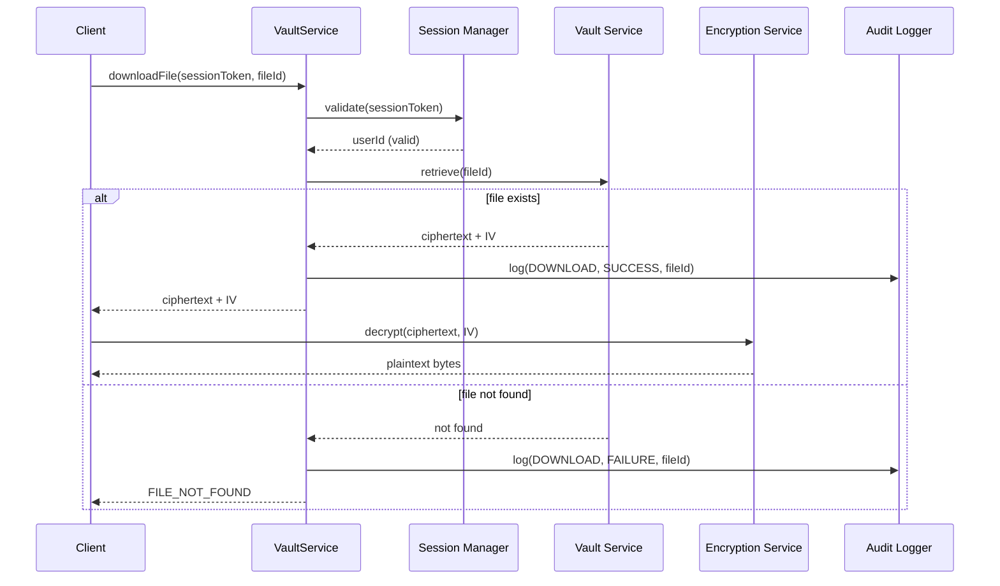

## 8. File Locking

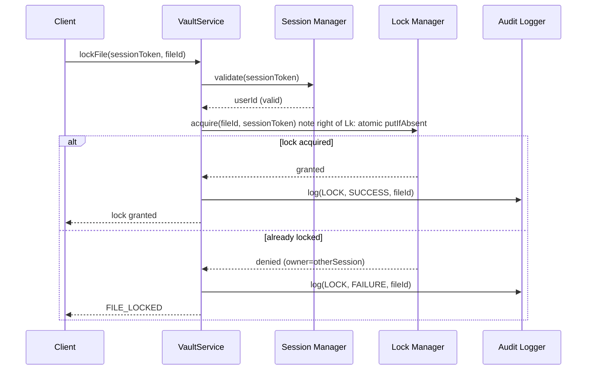

## 9. File Unlock

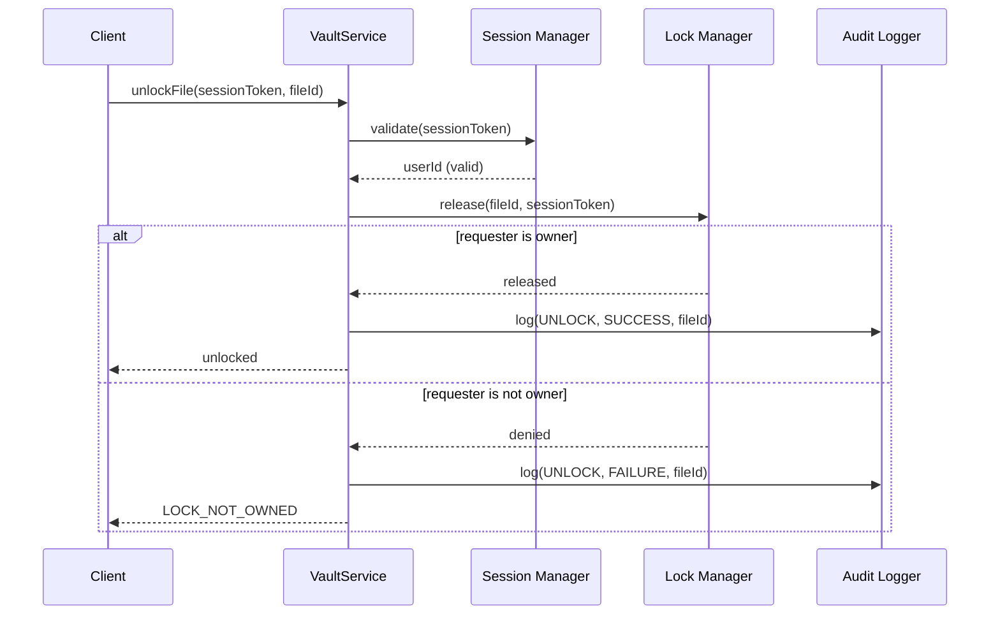

## 10. Concurrent Lock Attempt

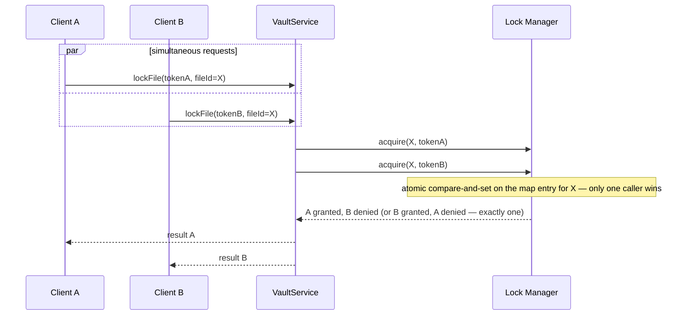

**Invariant (validated by [Testing.md](Testing.md) Concurrency Test):** regardless of arrival order or thread interleaving, exactly one of the racing requests receives `granted`; all others receive `FILE_LOCKED`.

## 11. Lock Timeout / Stale Lock

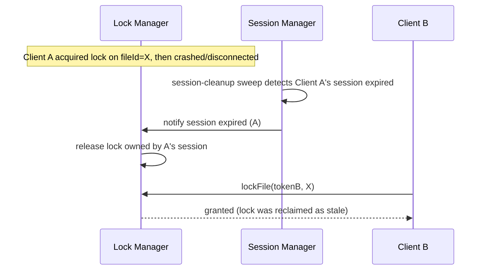

## 12. Logout

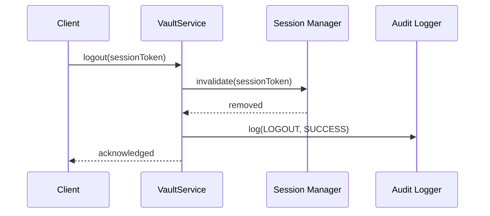

## 13. Invalid Session

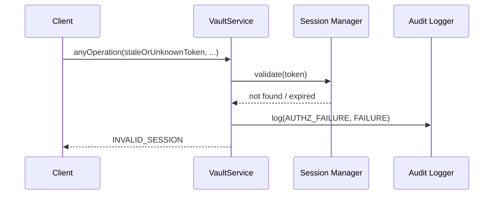

## 14. Unauthorized Access (Lock Not Owned)

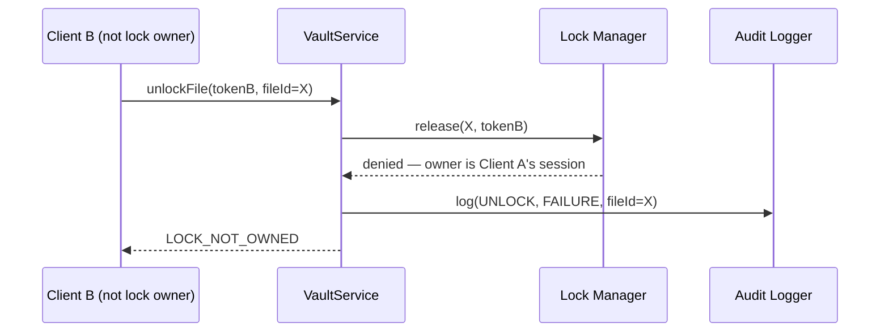

## 15. Upload Failure

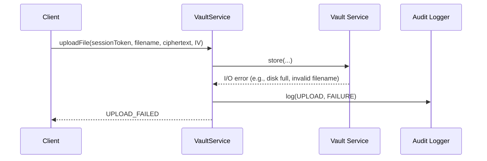

## 16. Download Failure

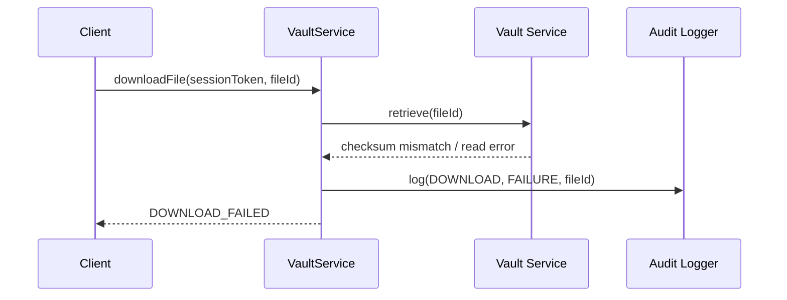

## 17. Server Unavailable

```mermaid
sequenceDiagram
    participant C as Client
    participant R as RMI Registry (unreachable)

    C->>R: lookup("VaultService")
    R--xC: connection refused / timeout
    C->>C: display "Server unavailable" state (FR-013)
    note over C: no operation attempted; retry left to user
```

## 18. Audit Logging (Cross-Cutting)

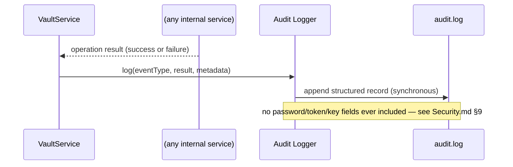

---

## Consistency Note

Every remote call named in these flows (`login`, `logout`, `listFiles`, `uploadFile`, `downloadFile`, `lockFile`, `unlockFile`) and every error code referenced (`AUTHENTICATION_FAILED`, `INVALID_SESSION`, `FILE_LOCKED`, `LOCK_NOT_OWNED`, `FILE_NOT_FOUND`, `UPLOAD_FAILED`, `DOWNLOAD_FAILED`) must exactly match [API-spec.md](API-spec.md). If either document changes, update both together (see [Development-rules.md](Development-rules.md) §4 Change Management).
