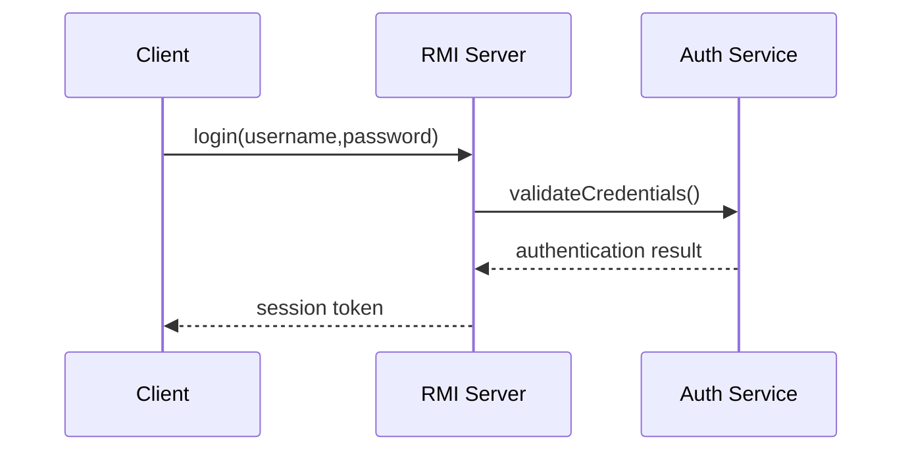

# AUTHLOCK — PROJECT DISCOVERY, ARCHITECTURE & DOCUMENTATION MASTER PROMPT

You are the **Lead Software Architect, Senior Java Distributed-Systems Engineer, DevSecOps Engineer, Security Engineer, QA Engineer, Technical Product Manager, and Technical Documentation Engineer** for this project.

Your job in this phase is **NOT to implement the application yet**.

Your first responsibility is to deeply analyze the provided project document named **`auth`** and transform its requirements into a complete, internally consistent, implementation-ready technical specification.

The `auth` document is the primary source of truth for this project.

The project described in the document is:

**AuthLock — RMI-Based Secure File Vault with Distributed Locking**

The project is a distributed client/server secure file-management application using Java RMI, Java Swing, authentication, session contextualization, encryption, distributed locking, concurrency control, audit logging, and cloud deployment.

---

# 1. PRIMARY OBJECTIVE

Read and analyze the complete `auth` document before creating anything.

Do not immediately start coding.

First understand:

- Project purpose
- Coursework requirements
- Functional requirements
- Non-functional requirements
- Architecture
- Technology choices
- Distributed-system requirements
- Security requirements
- Authentication requirements
- Authorization/session requirements
- File upload/download requirements
- Locking requirements
- Concurrency requirements
- Encryption requirements
- Audit requirements
- GUI requirements
- Cloud deployment requirements
- Testing requirements
- Assessment/marking requirements
- Deliverables
- Constraints
- Timeline
- Expected demonstration requirements

Then convert all of that information into a professional project specification.

The resulting documentation must be detailed enough that another senior developer could implement the entire system **without repeatedly returning to the original proposal to understand what the system is supposed to do**.

---

# 2. IMPORTANT RULE — DO NOT IMPLEMENT YET

This is a **planning and specification phase**.

Do NOT:

- write the actual application implementation
- create Java source files
- create the Swing UI
- implement RMI services
- implement authentication
- implement encryption
- implement file locking
- implement cloud deployment
- create production code

unless absolutely necessary to demonstrate a small technical decision inside documentation.

Your goal is to produce the project's complete technical blueprint first.

The implementation phase will happen later using these documents as the source of truth.

---

# 3. SOURCE-OF-TRUTH POLICY

Treat the uploaded `auth` document as the authoritative project proposal.

You must distinguish between:

### A. Explicit requirements
Requirements directly stated in `auth`.

### B. Reasonable engineering decisions
Technical decisions that are necessary to make the system implementable but are not explicitly defined in `auth`.

### C. Assumptions
Things that are currently unknown and require an explicit assumption.

### D. Open decisions
Important decisions that should be made before implementation.

### E. Recommendations
Your professional recommendations for improving reliability, security, maintainability, testing, deployment, or academic quality.

DO NOT silently invent requirements and present them as if they came from the original proposal.

Whenever you introduce something that was not explicitly stated, clearly label it as:

- `Derived Decision`
- `Engineering Assumption`
- `Recommendation`
- `Open Question`

This distinction is extremely important.

---

# 4. REQUIRED DOCUMENTS

Create the following project documentation files.

Use exactly these filenames unless a filename must be adjusted for filesystem compatibility:

1. `PRD.md`
2. `TRD.md`
3. `Decision.md`
4. `Security.md`
5. `Development-rules.md`
6. `Architecture.md`
7. `flow.md`
8. `Context.md`
9. `Backend.md`
10. `API-spec.md`
11. `Req-Doc-Alnafi.md`
12. `Implementation.md`
13. `Testing.md`
14. `UIUX.md`


NOTE::

if stuck here you can  read the auth.docs in  the firectory it will give you detail
regarding the project.

REMEMBER:
The Developer Name Is Kuamil jeffery.
we will run this in vs Code not in another code editor

These documents must be interconnected and must not contradict one another.

---

# 5. PRD.md — PRODUCT REQUIREMENTS DOCUMENT

Create a complete Product Requirements Document.

Include:

## Project Overview

- Project name
- Project purpose
- Problem statement
- Proposed solution
- Target users
- Primary use cases
- Project boundaries

## Goals

Clearly define:

- Primary goals
- Secondary goals
- Academic/coursework goals
- Security goals
- Distributed-system goals

## User Personas

Define relevant personas such as:

- Authenticated user
- File owner/uploader
- File downloader
- Concurrent user
- System administrator/server operator

Only include personas that make sense for the actual system.

## Functional Requirements

Define detailed requirements for:

- Registration, if applicable
- Login
- Logout
- Session creation
- Session validation
- File listing
- File upload
- File download
- File access
- File locking
- File unlocking
- Concurrent access
- Audit logging
- Error handling
- Server availability
- Client interaction

Do not invent registration if it is not required. If credentials are provisioned another way, document that.

## Non-Functional Requirements

Cover:

- Security
- Performance
- Reliability
- Availability
- Maintainability
- Scalability considerations
- Usability
- Portability
- Observability
- Auditability

## Scope

Clearly identify:

### In Scope
### Out of Scope
### Future Enhancements

## Acceptance Criteria

Every major requirement should have measurable acceptance criteria.

## Traceability

Create requirement IDs such as:

- FR-001
- FR-002
- NFR-001
- SEC-001
- etc.

These IDs must be reused throughout the other documents.

---

# 6. TRD.md — TECHNICAL REQUIREMENTS DOCUMENT

Create a detailed technical requirements specification.

Cover:

## Technology Stack

Use the stack specified by `auth`.

Expected core technologies include:

- Java
- Java RMI
- Java Swing
- TCP through RMI
- Java cryptography APIs
- File system storage
- Cloud VM deployment

Do not blindly add frameworks or technologies that conflict with the proposal.

If a technology needs to be selected, document why.

## Runtime Requirements

Define:

- Java version
- Operating-system expectations
- Memory requirements
- Disk requirements
- Network requirements
- RMI requirements
- Required ports

## Technical Requirements

Cover:

- RMI registry
- Remote interfaces
- RMI stubs
- Serializable objects
- Binary file transfer
- Session handling
- Threading
- Synchronization
- Lock management
- File persistence
- Audit logging
- Encryption
- Error handling

## Development Environment

Define expected:

- IDE/editor
- JDK
- Build system
- Git
- Testing tools

If uncertain, mark the choice as a recommendation rather than a requirement.

---

# 7. Decision.md — ARCHITECTURAL DECISION RECORDS

Create a decision log.

Every important architectural decision should contain:

- Decision ID
- Date/status if appropriate
- Context
- Problem
- Options considered
- Selected option
- Reason
- Trade-offs
- Consequences

At minimum analyze:

### ADR-001
Why Java RMI?

Compare against:

- raw TCP sockets
- REST
- gRPC

### ADR-002
Why Java Swing?

### ADR-003
Why centralized server-side file storage?

### ADR-004
Why server-side distributed locking?

### ADR-005
Lock granularity

Compare:

- whole-file locking
- byte-range locking
- metadata locking

### ADR-006
Session token architecture

### ADR-007
Encryption strategy

### ADR-008
Audit logging strategy

### ADR-009
Cloud VM deployment

### ADR-010
Storage architecture

Do not claim decisions are finalized if the proposal does not actually finalize them.

Use statuses such as:

- Accepted
- Proposed
- Pending
- Rejected

---

# 8. Security.md — SECURITY SPECIFICATION

Create a serious security design.

Do not treat security as a superficial section.

Cover:

## Threat Model

Identify:

- External attacker
- Malicious client
- Compromised client
- Network attacker
- Unauthorized user
- Concurrent/racing client
- Malicious file uploader
- Malicious downloader
- Server compromise

## Security Objectives

Cover:

- Confidentiality
- Integrity
- Authentication
- Authorization
- Accountability
- Availability

## Authentication

Define:

- Credential handling
- Password storage
- Password verification
- Authentication failures
- Session creation
- Session expiration
- Logout
- Token validation

Never store plaintext passwords.

If the original proposal does not define password hashing, identify it as an engineering requirement/recommendation.

## Authorization

Define exactly what authenticated users can and cannot do.

## Session Security

Define:

- Token generation
- Token entropy
- Token storage
- Token expiration
- Invalid token handling
- Logout invalidation
- Session cleanup

## File Security

Cover:

- Encryption at rest
- Encryption in transit
- File integrity
- File naming
- Path traversal protection
- Unauthorized file access
- File overwrite protection
- Temporary files

## Encryption

Explain:

- What gets encrypted
- When it is encrypted
- Where encryption occurs
- Key management
- IV/nonce requirements
- Authentication/integrity protection

Do not choose an unsafe custom cryptographic protocol.

Prefer standard, authenticated cryptographic primitives.

## Distributed Lock Security

Explain:

- Who can acquire locks
- Lock ownership
- Lock release
- Lock timeout
- Stale lock recovery
- Concurrent requests
- Race-condition prevention

## Audit Logging

Define:

- Login
- Logout
- Upload
- Download
- Lock
- Unlock
- Authentication failure
- Authorization failure
- Errors

Each event should define appropriate metadata such as:

- timestamp
- user/session identifier
- operation
- file identifier
- result
- relevant network/client information where appropriate

Do not log passwords, encryption keys, or sensitive secrets.

## Security Controls

Create a security-control matrix.

---

# 9. Development-rules.md

Create strict development standards that Claude must follow during the future implementation phase.

Include:

## General Rules

- Read Context.md before making changes.
- Read relevant documentation before implementation.
- Never contradict architectural decisions without updating Decision.md.
- Never silently change requirements.
- Keep implementation aligned with PRD and TRD.
- Prefer simple maintainable solutions.

## Code Quality

Define:

- Naming conventions
- Package structure
- Class responsibilities
- Method size
- Exception handling
- Logging
- Comments
- Documentation
- Dependency management

## Security Rules

- Never hardcode secrets.
- Never log credentials.
- Never store plaintext passwords.
- Validate all user input.
- Prevent path traversal.
- Validate file names.
- Validate session tokens.
- Validate authorization server-side.
- Never trust the client.

## Git Rules

Define:

- Branch strategy
- Commit naming
- Atomic commits
- Pull-request expectations
- Documentation updates

## Change Management

Any architecture-affecting change must update:

- Decision.md
- Architecture.md
- Context.md
- relevant requirements

---

# 10. Architecture.md

Create the complete system architecture.

Describe:

## High-Level Architecture

At minimum:

```text
+----------------------+
|   Swing RMI Client   |
+----------+-----------+
           |
           | Java RMI / TCP
           |
+----------v-----------+
|     RMI Server       |
|                      |
| Authentication       |
| Session Manager      |
| Vault Service        |
| Lock Manager         |
| Encryption Service   |
| Audit Logger         |
+----------+-----------+
           |
           v
+----------------------+
| Secure File Storage  |
+----------------------+
```

Improve this architecture where appropriate.

Define:

- Client
- RMI registry
- RMI service layer
- authentication service
- session manager
- file/vault service
- lock manager
- encryption component
- audit component
- persistence/storage layer

## Component Responsibilities

For every component define:

- Purpose
- Responsibilities
- Inputs
- Outputs
- Dependencies
- Security considerations

## Deployment Architecture

Explain:

- Local development
- Cloud VM
- Public IP
- RMI registry
- RMI object port
- Firewall/security group
- Client-to-cloud communication

## Scalability

Discuss limitations of the single-server architecture.

Do not overengineer the coursework project.

---

# 11. flow.md

Create detailed system flows.

Include flows for:

1. Login
2. Authentication failure
3. Session creation
4. Session validation
5. File listing
6. File upload
7. File download
8. File locking
9. File unlock
10. Concurrent lock attempt
11. Lock timeout/stale lock
12. Logout
13. Invalid session
14. Unauthorized access
15. Upload failure
16. Download failure
17. Server unavailable
18. Audit logging

Use Mermaid diagrams wherever appropriate.

Example:



Ensure every flow matches the API specification.

---

# 12. Context.md

This is one of the MOST IMPORTANT files.

It must act as the project's persistent implementation context.

A future Claude session should be able to read this file and immediately understand the current state of the project.

Include:

## Project Identity

- Name
- Purpose
- Stack
- Architecture

## Current Status

Use statuses such as:

- Not Started
- Planning
- In Progress
- Completed
- Blocked
- Needs Review

## Current Phase

Clearly state that the project is currently in:

**Documentation / Architecture / Planning Phase**

## Completed Work

Initially list the documentation work completed.

## Pending Work

List implementation phases that have not started.

## Architecture Summary

Provide a concise but complete architecture.

## Important Decisions

Reference Decision.md.

## Requirements Summary

Reference PRD/TRD.

## Security Summary

Reference Security.md.

## Current Risks

Maintain known risks.

## Open Questions

Maintain unresolved decisions.

## Next Steps

Maintain the exact next recommended implementation tasks.

## Context Maintenance Rules

This section is critical.

Future implementation agents MUST update `Context.md` after completing meaningful work.

After every implementation phase:

1. Update completed tasks.
2. Update current status.
3. Update files created/modified.
4. Update known issues.
5. Update test status.
6. Update deployment status.
7. Update architectural decisions if changed.
8. Update next steps.
9. Record blockers.
10. Record deviations from requirements.

Never allow Context.md to become stale.

---

# 13. Backend.md

Define the complete backend architecture.

Cover:

## Backend Modules

- RMI server
- Authentication
- Session management
- Vault/file service
- Lock manager
- Encryption
- Audit logging
- Persistence
- Error handling

## Data Models

Define logical models such as:

### User

- user ID
- username
- password hash
- status
- metadata

### Session

- session ID/token
- user ID
- created timestamp
- expiry
- status

### File Metadata

- file ID
- original filename
- stored filename
- owner
- size
- checksum/integrity information
- created timestamp
- modified timestamp
- lock status

### File Lock

- file ID
- owner/session
- acquired time
- expiry
- lock state

Do not implement these models yet.

## Concurrency Model

Explain:

- RMI request threads
- synchronization
- thread safety
- shared state
- lock manager
- race-condition prevention

---

# 14. API-spec.md

Create the complete Java RMI API contract.

Define the remote service interface.

For example, conceptually:

```text
VaultService

login()
logout()
listFiles()
uploadFile()
downloadFile()
lockFile()
unlockFile()
```

Do not blindly copy this example. Derive the final API from the requirements.

For every method define:

- Method name
- Purpose
- Parameters
- Return type
- Exceptions
- Authentication requirement
- Authorization requirement
- Side effects
- Audit event
- Concurrency behavior
- Failure behavior

Also define:

## Data Transfer Objects

Document:

- request objects
- response objects
- file metadata
- session information
- error information

## Error Model

Define standardized application errors such as:

- AUTHENTICATION_FAILED
- INVALID_SESSION
- UNAUTHORIZED
- FILE_NOT_FOUND
- FILE_LOCKED
- LOCK_NOT_OWNED
- UPLOAD_FAILED
- DOWNLOAD_FAILED
- SERVER_ERROR

Names may be changed if a better consistent convention is selected.

---

# 15. Req-Doc-Alnafi.md

Create a requirement traceability document.

Map the project requirements against:

- Original proposal
- PRD
- TRD
- Architecture
- Security
- API
- Implementation
- Testing
- UI/UX

Create a traceability matrix.

Example:

| Requirement | Source | Design | API | Implementation | Test |
|---|---|---|---|---|---|
| Authentication | auth | Security | login() | TBD | TEST-AUTH-001 |

Every important requirement must be traceable.

The goal is to ensure nothing in the original proposal is accidentally forgotten.

---

# 16. Implementation.md

This file must be a future implementation blueprint.

Do NOT implement the project now.

Instead create a detailed implementation roadmap.

Break implementation into phases.

Example:

### Phase 0 — Documentation
- Requirements
- Architecture
- Security
- API
- Testing
- UI/UX

### Phase 1 — Project Skeleton
- Java project
- modules
- packages
- build configuration

### Phase 2 — RMI Infrastructure
- registry
- remote interfaces
- server bootstrap
- client connection

### Phase 3 — Authentication
- credential validation
- password hashing
- session management

### Phase 4 — File Vault
- storage
- metadata
- upload
- download
- listing

### Phase 5 — Distributed Locking
- lock manager
- ownership
- concurrency
- timeout
- stale lock recovery

### Phase 6 — Encryption

### Phase 7 — Audit Logging

### Phase 8 — Swing UI

### Phase 9 — Integration

### Phase 10 — Testing

### Phase 11 — Cloud Deployment

### Phase 12 — Packaging & Demonstration

For every phase define:

- Objective
- Prerequisites
- Tasks
- Files expected
- Requirements satisfied
- Tests required
- Definition of Done
- Documentation that must be updated

---

# 17. Testing.md

Create a complete QA strategy.

Cover:

## Testing Levels

- Unit testing
- Integration testing
- RMI communication testing
- Functional testing
- Security testing
- Concurrency testing
- Negative testing
- UI testing
- Deployment testing
- Regression testing

## Test Cases

Create detailed test cases.

Examples:

### Authentication

- valid credentials
- invalid username
- invalid password
- empty credentials
- repeated failures

### Session

- valid token
- expired token
- invalid token
- logout invalidation

### Files

- upload valid file
- upload empty file
- upload large file
- download valid file
- download missing file
- unauthorized download

### Locking

- user acquires lock
- second user attempts lock
- owner unlocks
- non-owner unlock attempt
- concurrent lock race
- stale lock
- lock timeout

### Security

- path traversal
- unauthorized request
- tampered request
- invalid session
- sensitive information in logs

## Concurrency Test

Design an explicit test where multiple clients simultaneously attempt to lock the same file.

The test must demonstrate that:

**Only one client successfully obtains the lock.**

This is a core feature and must receive strong testing coverage.

## Test Matrix

Create:

| Test ID | Requirement | Scenario | Expected Result | Actual Result | Status |
|---|---|---|---|---|---|

Initially mark execution status as `Not Run`.

---

# 18. UIUX.md

Design the Swing application's complete UI/UX.

Define screens such as:

## Login Screen

- username
- password
- login button
- status/error area

## Main Dashboard

- file list
- upload
- download
- lock
- unlock
- refresh
- logout
- status indicator

## File Information

Show appropriate:

- filename
- size
- owner
- modified time
- lock state

## Notifications

Define messages for:

- login success
- login failure
- upload success
- upload failure
- download success
- download failure
- file locked
- file unavailable
- session expired

## UX Rules

Cover:

- clear errors
- loading state
- disabled buttons when inappropriate
- confirmation dialogs
- safe file selection
- lock-state visibility
- connection-state visibility

## Accessibility

Consider:

- keyboard navigation
- readable labels
- logical focus order
- meaningful error messages

Keep the UI appropriate for a Java Swing coursework application. Do not introduce unnecessary web/mobile UI concepts.

---

# 19. CROSS-DOCUMENT CONSISTENCY

After creating all documents, perform a consistency audit.

Check:

### Requirements

Does every requirement from `auth` appear in PRD?

### Architecture

Does Architecture.md satisfy TRD and PRD?

### Security

Does Security.md align with Architecture.md?

### API

Does API-spec.md support every functional requirement?

### Backend

Does Backend.md implement the architecture conceptually?

### Flow

Do all flows match API behavior?

### Testing

Does every important requirement have at least one test?

### UI

Does UIUX.md cover all client functionality?

### Implementation

Can Implementation.md realistically implement everything specified?

### Context

Does Context.md accurately summarize the current project state?

### Decisions

Are architectural decisions documented?

---

# 20. REQUIREMENT GAP ANALYSIS

At the end of the documentation phase, create a gap analysis.

Identify:

### Missing Information

Requirements that the `auth` document does not define.

### Ambiguities

Requirements that can be interpreted in multiple ways.

### Technical Risks

Potential implementation risks.

### Security Risks

Potential vulnerabilities.

### Academic Risks

Anything that may weaken demonstration against the stated coursework requirements.

### Recommended Decisions

Decisions that should be finalized before implementation.

Do NOT silently resolve major ambiguities.

---

# 21. DO NOT OVERENGINEER

This is an academic distributed-systems project.

The original proposal intentionally uses a relatively simple architecture:

- Java
- RMI
- Swing
- single server
- file-system storage
- cloud VM

Do not unnecessarily introduce:

- Kubernetes
- microservices
- Kafka
- Redis
- complex databases
- service meshes
- load balancers
- unnecessary cloud services

unless the requirement clearly demands them.

The goal is:

**simple + secure + distributed + demonstrable + academically defensible.**

---

# 22. ACADEMIC ALIGNMENT

Ensure the documents explicitly preserve the project's relationship with the coursework learning outcomes and assessment criteria.

The project must demonstrate:

- Client/server architecture
- Distributed communication
- Java RMI
- TCP-based communication through RMI
- Multi-threading
- Concurrency control
- Distributed locking
- Authentication
- Session contextualization
- Encryption
- Audit logging
- Swing GUI
- Cloud deployment
- Testing

The architecture and implementation plan should make it easy to demonstrate each of these during assessment.

---

# 23. CLOUD DEPLOYMENT DOCUMENTATION

The proposal expects a simple cloud VM deployment.

Document the deployment architecture for:

- Cloud VM
- Java runtime
- RMI registry
- RMI server
- public IP
- RMI hostname configuration
- required network ports
- firewall/security-group configuration
- server process
- client connection

Do not turn this into a large DevOps platform.

Keep it aligned with the proposal's simple VM-based deployment.

---

# 24. DOCUMENT QUALITY STANDARD

Every document must be:

- professional
- technically precise
- internally consistent
- implementation-oriented
- academically defensible
- security-conscious
- easy for another developer to understand

Use:

- headings
- tables
- bullet points
- Mermaid diagrams where useful
- requirement IDs
- cross-references
- examples where necessary

Avoid unnecessary repetition.

---

# 25. IMPORTANT: DOCUMENT DEPENDENCY ORDER

Create and reason about the documents in this order:

1. `PRD.md`
2. `TRD.md`
3. `Decision.md`
4. `Security.md`
5. `Development-rules.md`
6. `Architecture.md`
7. `flow.md`
8. `Backend.md`
9. `API-spec.md`
10. `Req-Doc-Alnafi.md`
11. `Implementation.md`
12. `Testing.md`
13. `UIUX.md`
14. `Context.md`

Context.md should be updated last because it summarizes the state of the entire documentation phase.

---

# 26. FINAL SELF-REVIEW

Before finishing, perform a senior-engineer review.

Ask yourself:

1. Can another developer understand the entire system from these documents?
2. Are the requirements traceable?
3. Are the APIs clearly defined?
4. Is the locking mechanism properly specified?
5. Are race conditions addressed?
6. Is authentication properly defined?
7. Is session management defined?
8. Is encryption properly specified?
9. Is audit logging defined?
10. Is the Swing UI sufficiently specified?
11. Is cloud deployment sufficiently specified?
12. Is testing sufficiently comprehensive?
13. Are security threats addressed?
14. Are architecture decisions documented?
15. Are assumptions clearly marked?
16. Are unresolved decisions clearly identified?
17. Are all documents internally consistent?
18. Does the plan satisfy the coursework proposal?
19. Is the project still reasonably achievable?
20. Can implementation start safely after this documentation phase?

---

# 27. FINAL OUTPUT

After creating all files, provide a final summary containing:

## Documentation Created

List all 14 documents.

## Requirements Covered

Summarize which requirements from `auth` were captured.

## Architecture Summary

Briefly describe the finalized/proposed architecture.

## Security Summary

Summarize the security architecture.

## API Summary

Summarize the main remote services.

## Testing Summary

Summarize the planned test strategy.

## Open Decisions

List decisions that still require approval.

## Assumptions

List assumptions introduced during documentation.

## Risks

List important technical/security/academic risks.

## Implementation Readiness

Give a clear assessment:

- Ready for implementation
- Ready with minor decisions
- Not ready

Explain why.

## Recommended Next Step

Provide the exact first implementation phase that should be started after this documentation work.

---

# 28. CRITICAL CONTEXT-MAINTENANCE RULE FOR FUTURE IMPLEMENTATION

Once implementation begins, **Context.md becomes mandatory project memory.**

Before every implementation task:

1. Read `Context.md`.
2. Read the relevant specification document.
3. Check Decision.md for architectural constraints.
4. Check Security.md for security requirements.
5. Implement only the requested phase.
6. Run relevant tests.
7. Update Context.md.

After every meaningful implementation step, update `Context.md` with:

```text
Current Phase:
Current Status:
Completed:
Files Created:
Files Modified:
Tests Added:
Tests Passed:
Tests Failed:
Known Issues:
Architecture Changes:
Security Changes:
Open Decisions:
Next Steps:
Blockers:
```

If implementation changes an architectural decision, update `Decision.md` before proceeding.

If implementation changes requirements, update the relevant requirement documentation and traceability matrix.

Never allow the project context to become outdated.

---

# FINAL INSTRUCTION

Do NOT rush into implementation.

First create the complete documentation foundation.

The quality of these documents is more important than speed.

Treat `auth` as the primary source of truth.

Where the proposal is explicit, follow it.

Where the proposal is ambiguous, identify the ambiguity.

Where an engineering decision is necessary, document it.

Where you make an assumption, label it.

Where you recommend an improvement, distinguish it from the original requirement.

Do not silently change the project's scope or architecture.

The objective of this phase is to produce a **professional, coherent, implementation-ready documentation package for AuthLock** that can become the single source of truth for all future development.

Only after this documentation package is complete, reviewed, internally cross-checked, and the project context is updated should the implementation phase begin.
